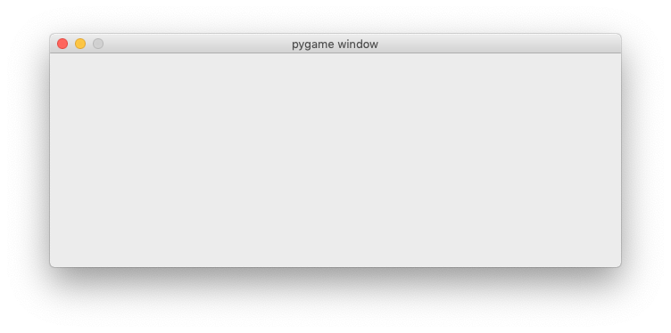
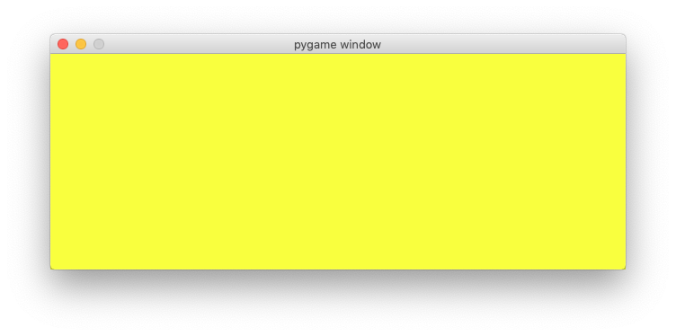
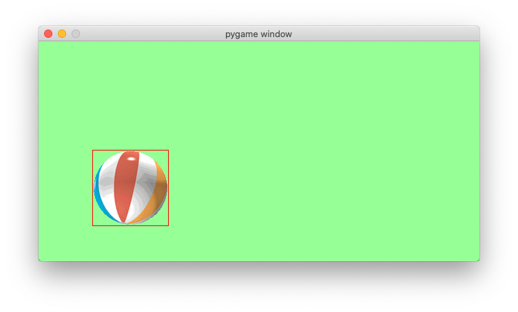

Introduction to Pygame
======================

Pygame is a multimedia library for Python for making games 
and multimedia applications.

It is a wrapper around the SDL (Simple DirectMedia Layer) library.
In this section we indroduce the basics of pygame functions without defining classes and objects.

Import the module
-----------------

To use the methods in the Pygame library, the module must first be imported::

    import pygame

The import statement writes the pygame version and a link to the
Pygame website to the console (as a side effect)::

    pygame 1.9.6
    Hello from the pygame community.
    https://www.pygame.org/contribute.html

The Pygame import statement is always placed at the beginning of the program.
It imports the pygame classes, methods and attributes into the current name space.
Now this new methods can be called via ``pygame.method()``. 

For exemple we can now initialize or quit **pygame** with the following command::

    pygame.init()
    pygame.quit()

The function ``display.set_mode()`` sets the screen size. It returns 
a ``Surface`` object wich we assign to the variable ``screen``. 
This variable will be one of the most used variables.
It represents the window we see::

    screen = pygame.display.set_mode((640, 240))

You can now run this program and test it. At this moment it does very little.
It opens a window and closes it immediately.

Show the event loop
-------------------

The most essential part of any interactive application is the **event loop**.
Reacting to events allows the user to interact with the application.
Events are the things that can happen in a program, such as a

- mouse click,
- mouse movement,
- keyboard press,
- joystick action.

The following is an infinite loop which prints all events to the console::

    while True:
        for event in pygame.event.get():
            print(event)

Try to move the mouse, click a mouse button, or type something on the keyboard.
Every action you do produces an event which will be printed on the console.
This will look something like this::

    <Event(4-MouseMotion {'pos': (173, 192), 'rel': (173, 192), 'buttons': (0, 0, 0), 'window': None})>
    <Event(2-KeyDown {'unicode': 'a', 'key': 97, 'mod': 0, 'scancode': 0, 'window': None})>
    <Event(3-KeyUp {'key': 97, 'mod': 0, 'scancode': 0, 'window': None})>
    <Event(12-Quit {})>

As we are in an infite loop, it is impossible to quit this program from within the application.
In order to quit the program, make the console the active window and type ``ctrl-C``.
This will write the following message to the console::

    ^CTraceback (most recent call last):
    File "/Users/raphael/GitHub/pygame-tutorial/docs/tutorial1/intro1.py", line 7, in <module>
        for event in pygame.event.get():
    KeyboardInterrupt

:download:`intro1.py<intro1.py>`

Quit the event loop properly
----------------------------

In order to quit the application properly, from within the application,
by using the window close button (QUIT event), we modify the event loop.
First we introduce the boolean variable ``running`` and set it
to ``True``. Within the event loop we check for the QUIT event.
If it occurs, we set ``running`` to ``False``::

    running = True
    while running:
        for event in pygame.event.get():
            if event.type == pygame.QUIT:
                running = False

    pygame.quit()

Once the event loop, we call the ``pygame.quit()`` function to end the application
correctly.

:download:`intro2.py<intro2.py>`

Define colors
-------------

Colors are defined as tuples of the base colors **red, green** and **blue**.
This is called the **RGB model**. 
Each base color is represented as a number between 0 (minimum) and 255 (maximum)
which occupies 1 byte in memory. An RGB color is thus represented as a 3-byte value.
Mixing two or more colors results in new colors.
A total of 16 million different colors can be represented this way.

.. image:: AdditiveColorMixing.png
   :scale: 50 %

Let's define the base colors as tuples of the tree base values.
Since colors are constants, we will write them using capitals.
The absence of all colors results in black.
The maximum value for all three components results in white.
Three identical intermediate values result in gray::

    BLACK = (0, 0, 0)
    GRAY = (127, 127, 127)
    WHITE = (255, 255, 255)

The tree base colors are defined as::

    RED = (255, 0, 0)
    GREEN = (0, 255, 0)
    BLUE = (0, 0, 255)

By mixing two base colors we obtained more colors::

    YELLOW = (255, 255, 0)
    CYAN = (0, 255, 255)
    MAGENTA = (255, 0, 255)

At the end of the event loop, we add the following::

    screen.fill(YELLOW)
    pygame.display.update()

The method ``fill(color)`` fills the whole screen with the specified color. 
At this point nothing will be displayed. In order to show anything, the function
``pygame.display.update()`` must be called.

:download:`intro3.py<intro3.py>`

Switch the background color
---------------------------

At the beginning of the program we add a new veriable ``background``
and initialize it to gray::

    background = GRAY

Within the event loop we are looking now for ``KEYDOWN`` events.
If found, we check if the R or G keys have been pressed and change the
background color to red (R) and green (G). This is the code added in the event loop::

        if event.type == pygame.KEYDOWN:
            if event.key == pygame.K_r:
                background = RED
            elif event.key == pygame.K_g:
                background = GREEN

In the drawing section we use now the variable ``background`` representing the
background color::

    screen.fill(background)
    pygame.display.update()

Test the program. 
Pressing the R and G keys allows you to switch the background color.

:download:`intro4.py<intro4.py>`

Import pygame.locals
--------------------

The ``pygame.locals`` module contains some 280 constants used and defined by pygme.
Placing this statement at the beginning of your programm imports them all::

    import pygame
    from pygame.locals import *

We find the key modifiers (alt, ctrl, cmd, etc.) ::

    KMOD_ALT, KMOD_CAPS, KMOD_CTRL, KMOD_LALT,
    KMOD_LCTRL, KMOD_LMETA, KMOD_LSHIFT, KMOD_META,
    KMOD_MODE, KMOD_NONE, KMOD_NUM, KMOD_RALT, KMOD_RCTRL,
    KMOD_RMETA, KMOD_RSHIFT, KMOD_SHIFT,

the number keys::

    K_0, K_1, K_2, K_3, K_4, K_5, K_6, K_7, K_8, K_9,

the special character keys::

    K_AMPERSAND, K_ASTERISK, K_AT, K_BACKQUOTE,
    K_BACKSLASH, K_BACKSPACE, K_BREAK,

the letter keys of the alphabet::

    K_a, K_b, K_c, K_d, K_e, K_f, K_g, K_h, K_i, K_j, K_k, K_l, K_m,
    K_n, K_o, K_p, K_q, K_r, K_s, K_t, K_u, K_v, K_w, K_x, K_y, K_z,

Instead of writing ``pygame.KEYDOWN`` we can now just write ``KEYDOWN``.

Use a dictionary to decode keys
-------------------------------

The easiest way to decode many keys, is to use a dictionary.
Instead of defining many if-else cases, we just create a dictionary with the keyboard key entries.
In this exemple we want to associate 8 different keys with 8 different background colors.
At the beginning of the programm we define this key-color dictionary::

    key_dict = {K_k:BLACK, K_r:RED, K_g:GREEN, K_b:BLUE,
        K_y:YELLOW, K_c:CYAN, K_m:MAGENTA, K_w:WHITE}

    print(key_dict)

Printing the dictionary to the console gives this result::

    {107: (0, 0, 0), 114: (255, 0, 0), 103: (0, 255, 0), 98: (0, 0, 255), 
    121: (255, 255, 0), 99: (0, 255, 255), 109: (255, 0, 255), 119: (255, 255, 255)}

The keys are presented here with their ASCII code. For exaple the ASCII code for 
``k`` is 107. Colors are represented as tuples. The color black is represented as (0, 0, 0).

The event loop now becomes very simple. 
First we check if the event type is a KEYDOWN event.
If yes, we check if the event key is in the dictionary.
If yes, we look up the color which is associated with that key 
and set the background color to it::

    if event.type == KEYDOWN:
        if event.key in key_dict:
            background = key_dict[event.key]

Try to press the 8 specified keys to change the background color.

Change the window caption
-------------------------

The function ``pygame.display.set_caption(title)`` allows to change the caption (title) 
of the application window. We can add this to the event loop::

    if event.key in key_dict:
        background = key_dict[event.key]
        
        caption = 'background color = ' + str(background)
        pygame.display.set_caption(caption)

This will display the RGB value of the current background color in the window caption.

.. image:: intro5.png

:download:`intro5.py<intro5.py>`

Explore a simple ball game
--------------------------

To show what Pygame can do, here is a simple program 
which demonstrates a bouncing ball animation.
The program uses the ``Rect`` class to represent a rectangular region.
An instance is created from the ball image::

    rect = ball.get_rect()

A ``Rect`` object has 4 attributes::

    rect.left
    rect.top
    rect.right
    rect.bottom

A ``Rect`` object can be moved with the ``move()`` method::

    rect = rect.move(speed)

After importing the pygame module, we define a few variables
such as screen size and two colors::

    import pygame
    from pygame.locals import *

    size = 640, 320
    width, height = size
    GREEN = (150, 255, 150)
    RED = (255, 0, 0)

Then we initialize pygame and create the ``screen`` variable::

    pygame.init()
    screen = pygame.display.set_mode(size)
    running = True

The ball position is represented with a ``Rect`` object::

    ball = pygame.image.load("ball.gif")
    rect = ball.get_rect()
    speed = [2, 2]

Inside the event loop we only check for the ``QUIT`` event::

    while running:
        for event in pygame.event.get():
            if event.type == QUIT: 
                running = False

Then we move the rectangle and check the left/right and top/bottom borders::

    rect = rect.move(speed)
    if rect.left < 0 or rect.right > width:
        speed[0] = -speed[0]
    if rect.top < 0 or rect.bottom > height:
        speed[1] = -speed[1]

Finaly we draw a green background, a red rectangle and the ball image::

    screen.fill(GREEN)
    pygame.draw.rect(screen, RED, rect, 1)
    screen.blit(ball, rect)
    pygame.display.update()

    pygame.quit()

This is what the ball and the ``Rect`` outline looks:

:download:`ball.gif<ball.gif>`

Try to understand what the program does.
Then try to modify it's parameters.

:download:`intro6.py<intro6.py>`
