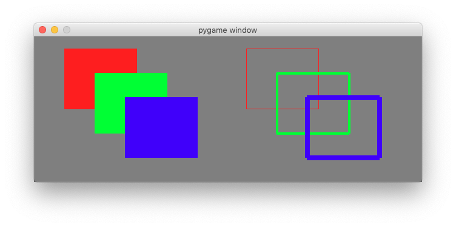
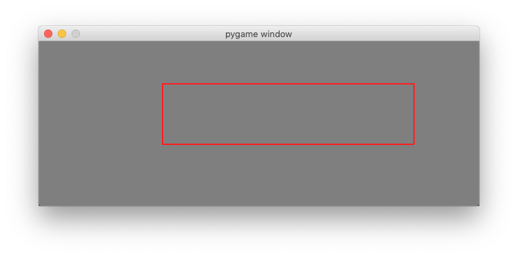
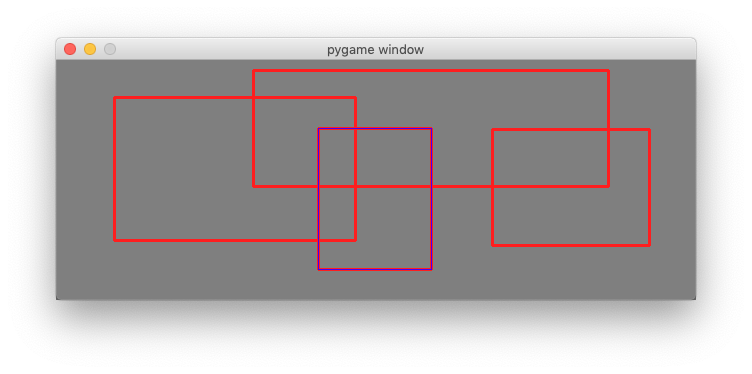

Drawing graphics primitives
============================

The ``pygame.draw`` module allows to draw simple shapes to a surface. 
This can be the screen surface or any Surface object such as an image or drawing:

- rectangle
- polygon
- circle
- ellipse

The functions have in common that they:

- take a **Surface** object as first argument
- take a color as second argument
- take a width parameter as last argument
- return a **Rect** object which bounds the changed area

the following format::

    rect(Surface, color, Rect, width) -> Rect
    polygon(Surface, color, pointlist, width) -> Rect
    circle(Surface, color, center, radius, width) -> Rect

Most of the functions take a width argument. If the width is 0, the shape is filled.

Draw solid and outlined rectangles
----------------------------------

The following draws first the background color and then adds three overlapping solid rectangles
and next to it three oulined overlapping rectangles with increasing line width::

    screen.fill(background)
    pygame.draw.rect(screen, RED, (50, 20, 120, 100))
    pygame.draw.rect(screen, GREEN, (100, 60, 120, 100))
    pygame.draw.rect(screen, BLUE, (150, 100, 120, 100))

    pygame.draw.rect(screen, RED, (350, 20, 120, 100), 1)
    pygame.draw.rect(screen, GREEN, (400, 60, 120, 100), 4)
    pygame.draw.rect(screen, BLUE, (450, 100, 120, 100), 8)

Try to modifiy the parameters and play with the drawing function.

Draw solid and outlined ellipses
--------------------------------

The following code draws first the background color and then adds three overlapping solid ellipses
and next to it three oulined overlapping ellipses with increasing line width::

    screen.fill(background)
    pygame.draw.ellipse(screen, RED, (50, 20, 160, 100))
    pygame.draw.ellipse(screen, GREEN, (100, 60, 160, 100))
    pygame.draw.ellipse(screen, BLUE, (150, 100, 160, 100))
    
    pygame.draw.ellipse(screen, RED, (350, 20, 160, 100), 1)
    pygame.draw.ellipse(screen, GREEN, (400, 60, 160, 100), 4)
    pygame.draw.ellipse(screen, BLUE, (450, 100, 160, 100), 8)

    pygame.display.update()

.. image:: draw2.png

:download:`draw2.py<draw2.py>`

Detect the mouse
----------------

Pressing the mouse buttons produces MOUSEBUTTONDOWN and MOUSEBUTTONUP events.
The flollowing code in the event loop detects them and writes the event to the console::

    for event in pygame.event.get():
        if event.type == QUIT:
            running = False
        elif event.type == MOUSEBUTTONDOWN:
            print(event)
        elif event.type == MOUSEBUTTONUP:
            print(event)   

Pressing the mouse buttons produces this kind of events::

    <Event(5-MouseButtonDown {'pos': (123, 88), 'button': 1, 'window': None})>
    <Event(6-MouseButtonUp {'pos': (402, 128), 'button': 1, 'window': None})>
    <Event(5-MouseButtonDown {'pos': (402, 128), 'button': 3, 'window': None})>
    <Event(6-MouseButtonUp {'pos': (189, 62), 'button': 3, 'window': None})>

Just moving the mouse produces a MOUSEMOTION event.
The following code detects them an writes the event to the console::

        elif event.type == MOUSEMOTION:
            print(event)

Moving the mosue produces this kind of event::

    <Event(4-MouseMotion {'pos': (537, 195), 'rel': (-1, 0), 'buttons': (0, 0, 0), 'window': None})>
    <Event(4-MouseMotion {'pos': (527, 189), 'rel': (-10, -6), 'buttons': (0, 0, 0), 'window': None})>
    <Event(4-MouseMotion {'pos': (508, 180), 'rel': (-19, -9), 'buttons': (0, 0, 0), 'window': None})>

Draw a rectangle with the mouse
-------------------------------

We can use this three events to draw a rectangle on the screen.
We define the rectangle by its diagonal start and end point.
We also need a flag which indicates if the mouse button is down and if we are drawing::

    start = (0, 0)
    size = (0, 0)
    drawing = False

When the mouse button is pressed, we set start and end to the current mouse position
and indciate with the flag that the drawing mode has started::

    elif event.type == MOUSEBUTTONDOWN:
        start = event.pos
        size = 0, 0
        drawing = True

When the mouse button is released, we set the end point
and indicate with the flag that the drawing mode has ended::

    elif event.type == MOUSEBUTTONUP:
        end = event.pos
        size = end[0] - start[0], end[1] - start[1]
        drawing = False

When the mouse is moving we have also have to check if we are in 
drawing mode. If yes, we set the end position to the current mouse position::

    elif event.type == MOUSEMOTION and drawing:
        end = event.pos
        size = end[0] - start[0], end[1] - start[1]

Finally we draw the rectangle to the screen. First we fill in
the background color. Then we calculate the size of the rectangle.
Finally we draw it, and at the very last we update the screen::

    screen.fill(GRAY)
    pygame.draw.rect(screen, RED, (start, size), 2)
    pygame.display.update()

:download:`mouse2.py<mouse2.py>`

Draw multiple shapes
--------------------

To draw multiple shapes, we need to place them into a list. Besides variables for 
``start``, ``end`` and ``drawing`` we add a rectangle list::

    start = (0, 0)
    size = (0, 0)
    drawing = False
    rect_list = []

When drawing of an object (rectangle, circle, etc.) is done, as indicated by a
MOUSEBUTTONUP event, we create a rectangle and append it to the rectangle list::

    elif event.type == MOUSEBUTTONUP:
        end = event.pos
        size = end[0]-start[0], end[1]-start[1]
        rect = pygame.Rect(start, size)
        rect_list.append(rect)
        drawing = False

In the drawing code, we first fill the background color, then iterate through the 
rectagle list to draw the objects (red, thickness=3), and finally we draw the current rectangle which
is in the process of being drawn (blue, thickness=1)::

    screen.fill(GRAY)
    for rect in rect_list:
        pygame.draw.rect(screen, RED, rect, 3)
    pygame.draw.rect(screen, BLUE, (start, size), 1)
    pygame.display.update()

Here is the complete file:

.. literalinclude:: mouse3.py

:download:`mouse3.py<mouse3.py>`

Draw a pologyon line with the mouse
-----------------------------------

To draw a polygon line we need to add the points to a list of points.
First we define an empty point list and a drawing flag::

    drawing = False
    points = []

At the MOUSEBUTTONDOWN event we add the current point to the list and 
set the ``drawing`` flag to True::

    elif event.type == MOUSEBUTTONDOWN:
        points.append(event.pos)
        drawing = True

At the MOUSEBUTTONUP event we deactivate the ``drawing`` flag::

    elif event.type == MOUSEBUTTONUP:
        drawing = False

At the MOUSEMOTION event we move the last point in the polygon list 
if the drawing flag is set::

    elif event.type == MOUSEMOTION and drawing:
        points[-1] = event.pos

If there are more than 2 points in the point list we draw a polygon line. 
Each ``pygame.draw`` function returns a ``Rect`` of the bounding rectangle.
We display this bounding rectangle in green::

    screen.fill(GRAY)
    if len(points)>1:
        rect = pygame.draw.lines(screen, RED, True, points, 3)
        pygame.draw.rect(screen, GREEN, rect, 1)
    pygame.display.update()

Pressing the ESCAPE key will remove the last point in the list::

    elif event.type == KEYDOWN:
        if event.key == K_ESCAPE:
            if len(points) > 0:
                points.pop()

.. image:: mouse4.png

Here is the complete file:

.. literalinclude:: mouse4.py

:download:`mouse4.py<mouse4.py>`