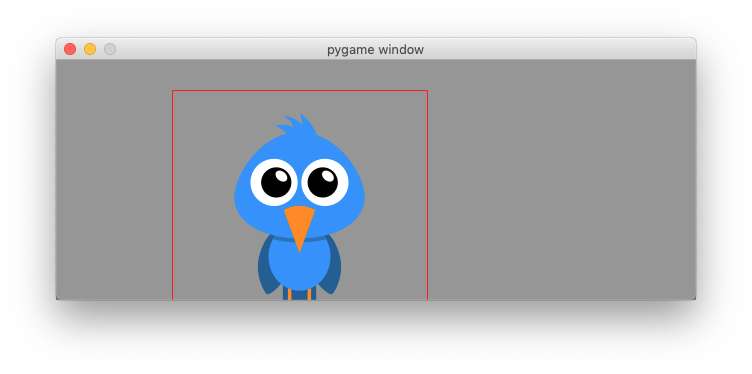
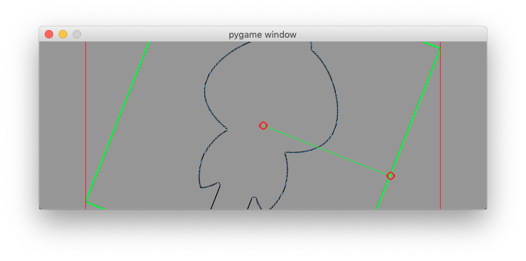
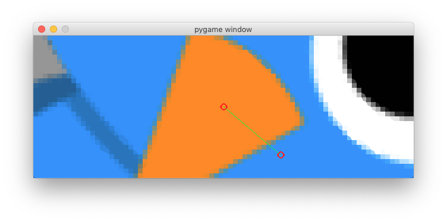
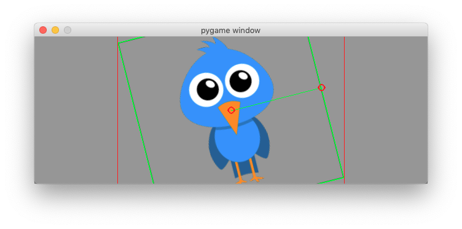

Work with images
================

Load an image
-------------

The ``pygame.image`` module provides methods for loading and saving 
images. The method ``load()`` loads an image from the file system
and returns a Surface object. The method ``convert()`` optimizes the 
image format and makes drawing faster::

    img = pygame.image.load('bird.png')
    img.convert()

Download the image ``bird.png`` to the same folder where your program resides:

:download:`bird.png<bird.png>`

The method ``get_rect()`` returns a Rect object from an image.
At this point only the size is set and position is placed at (0, 0).
We set the center of the Rect to the center of the screen::

    rect = img.get_rect()
    rect.center = w//2, h//2

To recapitulate, we are working with 3 objects:

- **screen** is the Surface object representing the application window
- **img** is the Surface object of the image to display
- **rect** is the Rect object which is the bounding rectangle of the image

To display the image we fill the screen with a background color (GRAY).
Then we blit the image, draw a red rectangle around it and finally update the screen::

    screen.fill(GRAY)
    screen.blit(img, rect)
    pygame.draw.rect(screen, RED, rect, 1)
    pygame.display.update()

Move the image with the mouse
-----------------------------

At the beginning of the programm we set a boolean variable ``moving`` to False.
Only when the mouse button is pressed, and when the mouse position is within the image (collidepoint) we set it to True::

    elif event.type == MOUSEBUTTONDOWN:
        if rect.collidepoint(event.pos):
            moving = True

When the mouse button is released, we set it to False again::

    elif event.type == MOUSEBUTTONUP:
        moving = False

When the mouse moves, and the flag ``moving`` is True, then we move the image
by the amount of relative movement (event.rel)::

    elif event.type == MOUSEMOTION and moving:
        rect.move_ip(event.rel)

This is the whole code:

.. literalinclude:: image1.py

:download:`image1.py<image1.py>`

Rotate and Scale the image
--------------------------

The ``pygame.transform`` module provides methods for **scaling, rotating and flipping** 
images. As we are going to modify the image **img** we keep the original image
in a variable called **img0**::

    img0 = pygame.image.load(path)
    img0.convert()

In order to show the image rectangle, we add a green border to the original image::

    rect0 = img0.get_rect()
    pygame.draw.rect(img0, GREEN, rect0, 1)

Then we place the place the image in the center of the screen::

    center = w//2, h//2
    img = img0
    rect = img.get_rect()
    rect.center = center

First we define the global variables **scale** and **angle**::

    angle = 0
    scale = 1

We use the R key to increment rotation by 10 degrees and 
(decrement if the SHIFT key is pressed). The function ``rotozoom()`` allows to combine
rotation and scaling. We always transform the orignial image (img0). Repeated rotation or scaling of 
an image would degrade its quality::

    if event.type == KEYDOWN:
        if event.key == K_r:
            if event.mod & KMOD_SHIFT:
                angle -= 10
            else:
                angle += 10
            img = pygame.transform.rotozoom(img0, angle, scale)

We use the S key to increment the scale by 10% (decrease if the SHIFT key 
is pressed)::

    elif event.key == K_s:
            if event.mod & KMOD_SHIFT:
                scale /= 1.1
            else:
                scale *= 1.1
            img = pygame.transform.rotozoom(img0, angle, scale)

As the image is transformed the bounding rectangle changes size. It must be 
recalulated and placed at the center again::

    rect = img.get_rect()
    rect.center = center

Reset the image to the original
-------------------------------

We use the O key to reset the image to its original state::

    elif event.key == K_o:
        img = img0
        angle = 0
        scale = 1

Flip the image
--------------

We use the H key to flip the image horizontally::

    elif event.key == K_h:
        img = pygame.transform.flip(img, True, False)

and the V key to flip the image vertically::

    elif event.key == K_v:
        img = pygame.transform.flip(img, False, True)

Detect edges with the Laplacian
-------------------------------

The fonction ``laplacien(img)`` allows to detect the outline of the image::

    elif event.key == K_l:
        img = pygame.transform.laplacian(img)

The fonction ``scale2x(img)`` doubles the size of a pixel::

    elif event.key == K_2:
        img = pygame.transform.scale2x(img)

Transform the image with the mouse
----------------------------------

In this section we show how to use the mouse to scale and rotate an image.
At the beginning we import the ``math`` module::

    import math

At the beginning we store the initial mouse position::

    mouse = pygame.mouse.get_pos()

When the mouse moves we update the mouse position ``mouse`` and calculate the **x, y** coordinates 
from the center of the image. 
We also calculate the center-mouse distance **d** ::

    elif event.type == MOUSEMOTION:
        mouse = event.pos
        x = mouse[0] - center[0]
        y = mouse[1] - center[1]
        d = math.sqrt(x ** 2 + y ** 2)

The ``atan2(y, x)`` math function allows to find the rotation angle. We need to 
transform radians in degrees. From the distance mouse-center we calculate the 
scale argument::

        angle = math.degrees(-math.atan2(y, x))
        scale = abs(5 * d / w)
        img = pygame.transform.rotozoom(img0, angle, scale)
        rect = img.get_rect()
        rect.center = center

To finally draw the transformed image we first fille the whole screen background (GRAY), 
blit the transformed image, surround it with a red rectangle.

In order to give visual feedback for the mouse action when transforming an image, we

* draw a green line between the center of the image and the mouse position, 
* place two circles on the center and on the mouse position::

    screen.fill(GRAY)
    screen.blit(img, rect)
    pygame.draw.rect(screen, RED, rect, 1)
    pygame.draw.line(screen, GREEN, center, mouse, 1)
    pygame.draw.circle(screen, RED, center, 6, 1)
    pygame.draw.circle(screen, RED, mouse, 6, 1)
    pygame.display.update()

Here is the full code.

.. literalinclude:: image2.py

:download:`image2.py<image2.py>`
