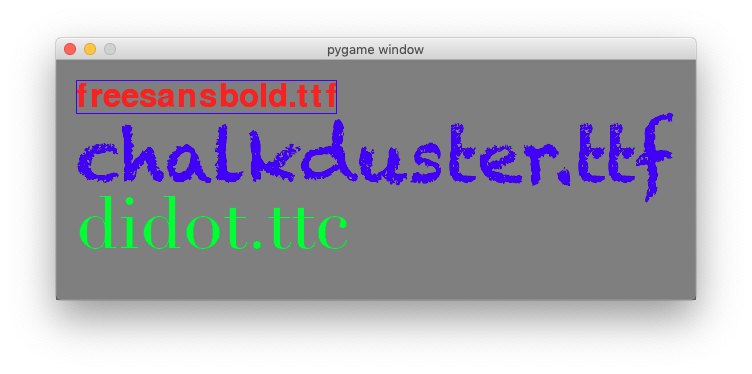

Work with text
==============

In pygame, text cannot be written directly to the screen. The first step is
to create a ``Font`` object with a given size. The second step is to render 
the text into an image with a given color.
The third step is to blit the image to the screen. These are the steps::

    font = pygame.font.SysFont(None, 24)
    img = font.render('hello', True, BLUE)
    screen.blit(img, (20, 20))

Once the font is created, its size cannot be changed. 
A ``Font`` object is used to create a ``Surface`` object from text. Pygame does not 
provide a direct way to write text onto a ``Surface`` object. ``render()`` must be
used to create a Surface object of the text which then can be blit to the screen.
The method ``render()`` can only render single lines. A newline character
is not rendered.

Initializing the font can take a few seconds. On a MacBook Air the the creation of 
a system Font object::

    t0 = time.time()
    font = pygame.font.SysFont(None, 48)
    print('time needed for Font creation :', time.time()-t0)

took more then 8 seconds::

    time needed for Font creation : 8.230187892913818

The function ``get_fonts()`` returns a list of fonts. The following code 
checks what fonts are on your system and how many, and prints them to the console::

    fonts = pygame.font.get_fonts()
    print(len(fonts))
    for f in fonts:
        print(f)

You will get something like this::

    344
    bigcaslonttf
    silomttf
    sfnsdisplayblackitalicotf
    chalkdusterttf
    ...

The font object can render a given text into an image. In the example below, 
we place a blue bounding rectangle around that text image::

    img = font.render(sysfont, True, RED)
    rect = img.get_rect()
    pygame.draw.rect(img, BLUE, rect, 1)

We then create two more fonts, *Chalkduster* and *Didot* at a size of 
72 points. We render a text with both fonts::

    font1 = pygame.font.SysFont('chalkduster.ttf', 72)
    img1 = font1.render('chalkduster.ttf', True, BLUE)

    font2 = pygame.font.SysFont('didot.ttc', 72)
    img2 = font2.render('didot.ttc', True, GREEN)

Finally the text images are blit to the screen like regular images::

    screen.fill(background)
    screen.blit(img, (20, 20))
    screen.blit(img1, (20, 50))
    screen.blit(img2, (20, 120))
    pygame.display.update()

This is the result:

Here is the full code.

.. literalinclude:: text1.py