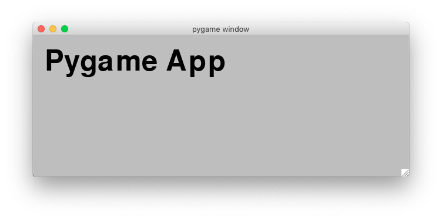
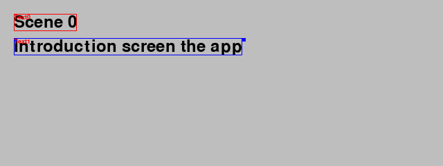
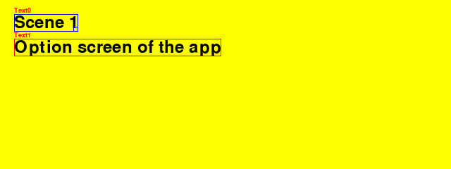
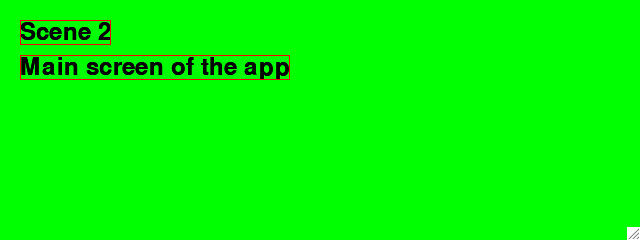
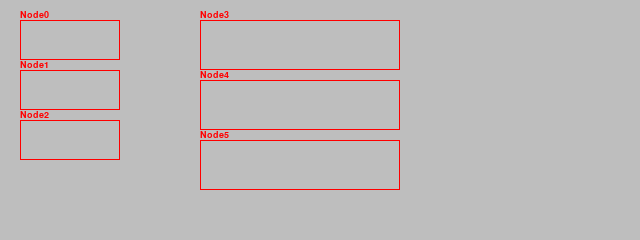
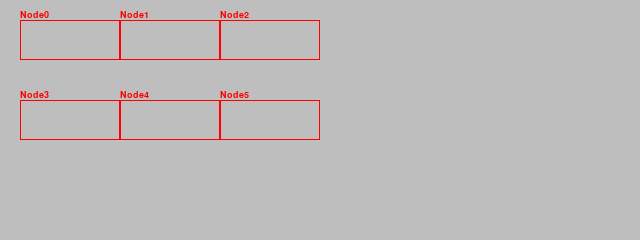
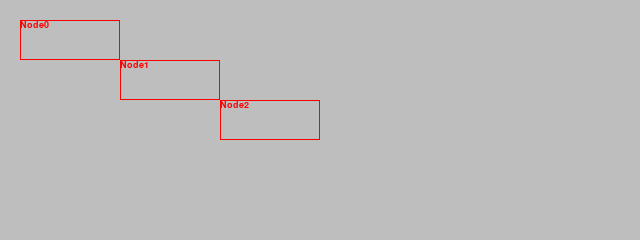

Making apps with Pygame
=======================

In this section we are going to create applications and games with Pygame. From here on we will be 
using an object-oriented programming (OOP) approach.

Pygame only allows to create one single window. Different from other applications,
those based on Pygame cannot have multiple windows. If for example dialog window is needed, it must be displayed within the main window.

Within an application we provide multples scenes (environments, rooms, or levels).
Each scene contains different objects such as:

- text
- sprites (images)
- GUI elements (buttons, menus)
- shapes (rectangles, circles)

Create the App class
--------------------

The basis for a game or application is the ``App`` class. The first thing to do is to import 
the ``pygame`` module, as well as a series of useful constants::

    import pygame
    from pygame.locals import *

Then we create define the App class which initializes Pygame and opens a the app 
window::

    class App:
        """Create a single-window app with multiple scenes."""

        def __init__(self):
            """Initialize pygame and the application."""
            pygame.init()
            flags = RESIZABLE
            App.screen = pygame.display.set_mode((640, 240), flags)

            App.running = True 

Further we have to define the main event loop::

    def run(self):
        """Run the main event loop."""
        while App.running:
            for event in pygame.event.get():
                if event.type == QUIT:
                    App.running = False
        pygame.quit()

At the end of the module we run a demo, if the program is run directly and not 
imported as a module::

    if __name__ == '__main__':
        App().run()

Add the Text class
------------------

Now we add some text to the screen. We create a Text class from which we can 
instantiate text objects::

    class Text:
        """Create a text object."""

        def __init__(self, text, pos, **options):
            self.text = text
            self.pos = pos

            self.fontname = None
            self.fontsize = 72
            self.fontcolor = Color('black')
            self.set_font()
            self.render()

The ``Font`` object needs to be created initially and everytime
the font name or the font size changes::

    def set_font(self):
        """Set the font from its name and size."""
        self.font = pygame.font.Font(self.fontname, self.fontsize)

The text needs to be rendered into a surface object, an image. This needs to be
done only once, or whenever the text changes::

    def render(self):
        """Render the text into an image."""
        self.img = self.font.render(self.text, True, self.fontcolor)
        self.rect = self.img.get_rect()
        self.rect.topleft = self.pos

Drawing the text means blitting it to the application screen::

    def draw(self):
        """Draw the text image to the screen."""
        App.screen.blit(self.img, self.rect)

This is the result:

Here is the complete code:

.. literalinclude:: app2.py

Shortcut keys
-------------

Key presses (called shortcuts) can be used to interact with the application and run
commands. We can add the following code inside the event loop to
intercept the S key and print a message::

    if event.type == KEYDOWN:
        if event.key == K_s:
            print('Key press S')

If the application has many shortcuts, the keys alone may not be enough and modifier keys (cmd, ctrl, alt, shift) can be used
to increase the number of combinations.
The easiest way to represent these shortcuts is under the form of a dictionary,
where the key/mod tuples are associated with a command strings. 
The dictionary has this shape::

    self.shortcuts = {
        (K_x, KMOD_LMETA): 'print("cmd+X")',
        (K_x, KMOD_LALT): 'print("alt+X")',
        (K_x, KMOD_LCTRL): 'print("ctrl+X")',
        (K_x, KMOD_LMETA + KMOD_LSHIFT): 'print("cmd+shift+X")',
        (K_x, KMOD_LMETA + KMOD_LALT): 'print("cmd+alt+X")',
        (K_x, KMOD_LMETA + KMOD_LALT + KMOD_LSHIFT): 'print("cmd+alt+shift+X")',
    }

Inside the event loop we detect keydown events and call the key handler::

    if event.type == KEYDOWN:
        self.do_shortcut(event)

The ``do_shortcut()`` method looks up the shortcut and executes the command string::

    def do_shortcut(self, event):
        """Find the the key/mod combination in the dictionary and execute the cmd."""
        k = event.key
        m = event.mod
        if (k, m) in self.shortcuts:
            exec(self.shortcuts[k, m])

This is the result on the console when pressing different key+modifier combinations::

    cmd+X
    alt+X
    ctrl+X
    cmd+shift+X
    cmd+alt+X
    cmd+alt+shift+X

Fullscreen, resizable and noframe mode
--------------------------------------

Pygame allows a window to be displayed in 3 different modes:

* fullscreen mode
* resizable (a resize edge is displayed)
* noframe mode (without a window title bar)

Inside the ``App`` class ``__init__()`` method we first define the screen size and the 
display mode flags, and then create the ``screen`` surface::

    self.flags = RESIZABLE
    self.rect = Rect(0, 0, 640, 240)
    App.screen = pygame.display.set_mode(self.rect.size, self.flags)

In order to toggle (turn on and off) the three display modes we 
add these entries to the ``shortcuts`` dictionary::

    (K_f, KMOD_LMETA): 'self.toggle_fullscreen()',
    (K_r, KMOD_LMETA): 'self.toggle_resizable()',
    (K_g, KMOD_LMETA): 'self.toggle_frame()',

Inside the ``App`` class we define three methods to toggle the corresponding mode flag,
by using the bit-wise XOR operator (``^=``)::

    def toggle_fullscreen(self):
        """Toggle between full screen and windowed screen."""
        self.flags ^= FULLSCREEN
        pygame.display.set_mode((0, 0), self.flags)

    def toggle_resizable(self):
        """Toggle between resizable and fixed-size window."""
        self.flags ^= RESIZABLE
        pygame.display.set_mode(self.rect.size, self.flags)

    def toggle_frame(self):
        """Toggle between frame and noframe window."""
        self.flags ^= NOFRAME
        pygame.display.set_mode(self.rect.size, self.flags)

Add the Scene class
-------------------

Most applications or games have different scenes, such as an introduction screen, 
an intro, and different game levels. So we are going to define the Scene class::

    class Scene:
        """Create a new scene (room, level, view)."""
        id = 0
        bg = Color('gray')

When creating a new scene, we append the scene to the applications scene list
and make this scene the current scene::

    def __init__(self, *args, **kwargs):
        # Append the new scene and make it the current scene
        App.scenes.append(self)
        App.scene = self

Then we set a scene id, which is kept as class attribute of the Scene class.
Then we set the nodes list to the empty list and set the background color::

        # Set the instance id and increment the class id
        self.id = Scene.id
        Scene.id += 1
        self.nodes = []
        self.bg = Scene.bg

The scene object knows how to draw itself. It first fills the background with the 
background color, then draws each nodes and finally flips the display to update the
screen::

    def draw(self):
        """Draw all objects in the scene."""
        App.screen.fill(self.bg)
        for node in self.nodes:
            node.draw()
        pygame.display.flip()

The string representation of the scene is *Scene* followed by its ID number::

    def __str__(self):
        return 'Scene {}'.format(self.id)

This is an image of scene 0 with two text objects and a default gray background color.
The second text object has been selected.

This is an image of scene 1 with two text objects, the first one being selected 
and a yellow background color.

This is an image of scene 2 with two text objects, none being selected, and a green background color.

Here is the complete code:

.. literalinclude:: app3.py

Scenes with background images
-----------------------------

We can add a background image to a scene::

    self.file = Scene.options['file']

    if self.file != '':
        self.img = pygame.image.load(self.file)
        size = App.screen.get_size()
        self.img = pygame.transform.smoothscale(self.img, size)
    self.enter()

This is an image of scene 0 with a forest background image and a 
white Text object.

This is an image of scene 1 with a lake background image and a
black Text object.

This is an image of scene 2 with a sunset background image and a
white Text object.

Here is the complete code:

.. literalinclude:: app4.py

Automatic node placement
------------------------

Nodes are containers for GUI elements. It is convenient
if they can be placed automatically inside a scene.

* ``pos`` the current position
* ``size`` the current size
* ``dir`` the current direction: vertical (1, 0), horizontal (0, 1), diagonal (1, 1)
* ``gap`` the spacing

The default placement direction is vertical. 
Nodes placed in a scene stack up vertically. 
At any time the node position, node size, 
node gap or node direction can be changed::

    Scene(caption='Nodes - vertical placement')
    Node()
    Node()
    Node()

    Node(pos=(200, 20))
    Node()
    Node()
    

Here we change the node placement direction to horizontal, dir=(0, 1).
At any time we can change the node position or gap.
We can place the inital node position at (0, 0) and change the gap to (0, 0)::

    Scene(caption='Nodes - horizontal placement')
    Node(dir=(1, 0), pos=(0, 0), gap=(0, 0))
    Node()
    Node()

    Node(pos=(0, 100))
    Node()
    Node()

The placement can also be diagonal by chosing the direction vector
dir = (1, 1)::

    Scene(caption='Nodes - diagonale placement')
    Node(dir=(1, 1), gap=(0, 0))
    Node()
    Node()

Here is the complete code:

.. literalinclude:: node1.py
