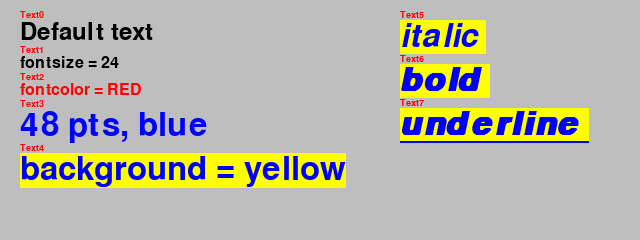
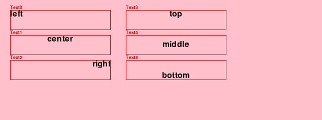
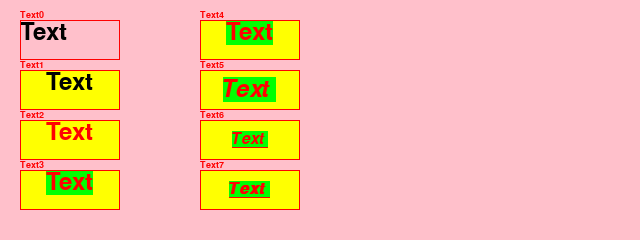
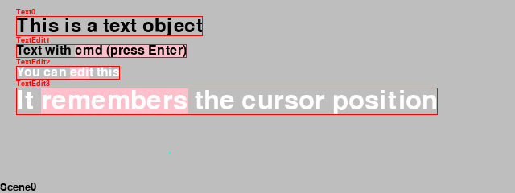
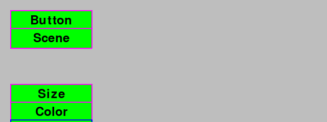
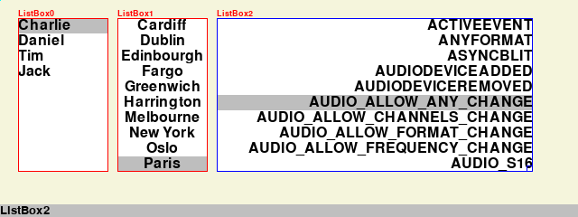

Create a graphical user interface (GUI)
=======================================

The graphical user interface (GUI) consists of all the elements the user can interact with 
(read, click, drag, resize, select, input):

- text
- button
- checkbutton
- radiobutton
- menu (pop-up, pull-down)
- listboxe
- slider

Text attributes
---------------

We store all pygame text attributes as class variables::

    class Text(Node):
        """Create a text object which knows how to draw itself."""

        fontname = None
        fontsize = 36
        fontcolor = Color('black')
        background = None
        italic = False
        bold = False
        underline = False

After initializing the Node, we update the instance variables
from the Text class variables::

    super().__init__(**options)
    self.__dict__.update(Text.options)

The font size and the three styles (bold, italic, underline) are set at font creation::

   def set_font(self):
        """Set the font and its properties."""
        self.font = pygame.font.Font(self.fontname, self.fontsize)
        self.font.set_bold(self.bold)
        self.font.set_italic(self.italic)
        self.font.set_underline(self.underline)

The font color and the background color are set when rendering the text::

    def render(self):
        """Render the text into an image."""
        self.img = self.font.render(self.text, True, self.fontcolor, self.background)
        self.rect.size = self.img.get_size()

Here is a code example:

.. literalinclude:: text1.py

Which produces this result:

Horizontal and vertical alignment
---------------------------------

For a given box size, text can be aligned horizontally to the left, center, or right.
The following code aligns the text image with these three positions::

    w, h = self.rect.size
    w0, h0 = self.text_img.get_size()
    
    if self.h_align == 0:
        x = 0
    elif self.h_align == 1:
        x = (w-w0)//2
    else:
        x = w-w0

In the vertical direction the text image can be aligned at the top, middle or bottom::

    if self.v_align == 0:
        y = 0
    elif self.v_align == 1:
        y = (h-h0)//2
    else:
        y = h-h0

    self.img0.blit(self.text_img, (x, y))
    self.img = self.img0.copy()

The image `img0` is the orignal, used for scaling. The `img` is the one used for drawing.

Here is a code example:

.. literalinclude:: text2.py

Which produces the following result:

Text attributes
---------------

A Text object has various attributes which are remembered.

Here is a code example:

.. literalinclude:: text3.py

It produces the following result:

Editable text
-------------

The class :class:`TextEdit` provides editable text with a movable cursor. 
The cursor is represented as a small rectangle which is rendered under the text.
A selection is represented as a large rectangle under the selected letters.

Create the cursor
^^^^^^^^^^^^^^^^^

The class attribute ``TextEdit.cursor`` defines the cursor color and width::

    cursor = Color('red'), 2  # cursor color and width

Inside the conxtructor, the cursor is placed at the end of the text.
A cursor image is created and filled with the cursor color. The cursor rectangle
is initally placed at the end of the text::

    col, d = TextEdit.cursor
    self.cursor = len(self.text)
    self.cursor_img = pygame.Surface((d, self.rect.height))
    self.cursor_img.fill(col)
    self.cursor_rect = self.cursor_img.get_rect()
    self.cursor_rect.topleft = self.rect.topright

Get the character index
^^^^^^^^^^^^^^^^^^^^^^^

The cursor is represented as an integer index in the range [0 .. n] where n is the 
lenght of the text. Each letter has a different width. The list
``self.char_positions`` remembers the x position of each letter::

    def set_char_positions(self):
        """Get a list of all character positions."""
        self.char_positions = [0]
        for i in range(len(self.text)):
            w, h = self.font.size(self.text[:i+1])
            self.char_positions.append(w)

When we click with the mouse anywhere in the text, we need to know the character index::

    def get_char_index(self, position):
        """Return the character index for a given position."""
        for i, pos in enumerate(self.char_positions):
            if position <= pos:
                return i
        # if not found return the highest index
        return i

Move the cursor
^^^^^^^^^^^^^^^

The arrow keys allow to move the cursor to the left or to the right.
The argument ``d`` is 1 or -1 and indicates the direction of movement. 
The cursor movement is limit to the interval [0 .. n]::

    def move_cursor(self, d):
        """Move the cursor by d charactors, and limit to text length."""
        mod = pygame.key.get_mods()
        n = len(self.text)
        i = min(max(0, self.cursor+d), n)

Pressing the CMD key, the cursor goes all the way to the beginning or the end of the line::

        if mod & KMOD_META:
            if d == 1:
                i = n
            else:
                i = 0

Pressing the ALT key, the cursor goes to the end of the word::

        if mod & KMOD_ALT:
            while (0 < i < n) and self.text[i] != ' ':
                i += d

Pressing the SHIFT key prevents cursor2 from moving, thus setting a selection::

        if not mod & KMOD_SHIFT:
            self.cursor2 = i

        self.cursor = i

Copy, cut and insert text
^^^^^^^^^^^^^^^^^^^^^^^^^

The two cursors can be inverted. The following method returns the two
cursors (selection indices) in the right order:: 

    def get_selection_indices(self):
        """Get ordered tuple of selection indicies."""
        i = self.cursor
        i2 = self.cursor2
        
        if i < i2:
            return i, i2
        else:
            return i2, i 

To copy text we save the selection in a Scene variable ``text``::

    def copy_text(self):
        """Copy text to Scene.text buffer."""
        i, i2 = self.get_selection_indices()
        text = self.text[i:i2]
        App.scene.text = text

To cut text we copy the text and replace the selection with an empty string::

    def cut_text(self):
        """Cut text and place copy in Scene.text buffer."""
        self.copy_text()
        self.insert_text('')

To insert text we replace the current selection with the new text::

    def insert_text(self, text):
        """Insert text at the cursor position or replace selection."""
        i, i2 = self.get_selection_indices()
        text1 = self.text[:i]
        text2 = self.text[i2:]
        self.text = text1 + text + text2
        self.cursor = i + len(text)
        self.cursor2 = self.cursor

Buttons
-------

The button class displays a text and executes a command upon a mouse-click

ListBox
--------

The ListBox class displays a list of items. One item can be selected with
a mouse-click or with the UP/DOWN arrow keys. Pressing the RETURN key executes the command.

Detecting double-clicks
-----------------------

In order to detect double-clicks or multiple clicks we need to use a timer event.
The reason for using a timer is that we cannot know at the time of a mouse click
if there are more clicks to follow. We only know for sure after a short timeout period.
So we define a new event as the first USEREVENT::

    DBL_CLICK_TIMER = pygame.USEREVENT
    DBL_CLICK_TIMEOUT = 250

Inside the ``Scene.do_event()`` we look for a MOUSEBUTTONDOWN event 
and we set a timer and increment the clicks::

    if event.type == MOUSEBUTTONDOWN:
        pygame.time.set_timer(DBL_CLICK_TIMER, DBL_CLICK_TIMEOUT)
        self.clicks += 1

Once the timeout occurs, we 

- reset (disable) the timer
- print the number of clicks and
- reset the click count to zero::

    elif event.type == DBL_CLICK_TIMER:
        pygame.time.set_time(DBL_CLICK_TIMER, 0)
        print(self.clicks, 'clicks in', self.focus)
        self.clicks = 0

The text printed to the console looks like this:

.. code-block:: none

    2 clicks in Text0
    4 clicks in Text0
    3 clicks in Ellipse1
    1 clicks in Rectangle2
    2 clicks in None