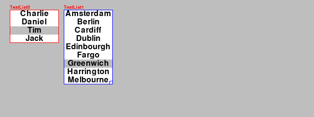

Create a graphical user interface (GUI)
=======================================

The graphical user interface (GUI) consists of all the elements the user can interact with 
(read, click, drag, resize, select, input):

- text
- buttons
- checkboxes, radio buttons
- menus (pop-up, pull-down)
- listboxes
- sliders

Text attributes
---------------

We store all pygame text attributes as class variables::

    class Text(Node):
        """Create a text object which knows how to draw itself."""

        fontname = None
        fontsize = 36
        fontcolor = Color('black')
        background = None
        italic = False
        bold = False
        underline = False

After initializing the Node, we update the instance variables
from the Text class variables::

    super().__init__(**options)
    self.__dict__.update(Text.options)

The font size and the tree styles (bold, italic, underline) are set at font creation::

   def set_font(self):
        """Set the font and its properties."""
        self.font = pygame.font.Font(self.fontname, self.fontsize)
        self.font.set_bold(self.bold)
        self.font.set_italic(self.italic)
        self.font.set_underline(self.underline)

The font color and the backgroudn color are set when rendering the text::

    def render(self):
        """Render the text into an image."""
        self.img = self.font.render(self.text, True, self.fontcolor, self.background)
        self.rect.size = self.img.get_size()

Here is a code example:

.. literalinclude:: text1.py

Which produces the following result.

.. image:: text1.png

Horizontal and vertical alignement
----------------------------------

For a given box size, text can be aligned horizontally to the left, center, or right.
The following code places the text image to these three positions::

    w, h = self.rect.size
    w0, h0 = self.text_img.get_size()
    
    if self.h_align == 0:
        x = 0
    elif self.h_align == 1:
        x = (w-w0)//2
    else:
        x = w-w0

In the vertical position the text image can be aligne at the top, middle or bottom::

    if self.v_align == 0:
        y = 0
    elif self.v_align == 1:
        y = (h-h0)//2
    else:
        y = h-h0

    self.img0.blit(self.text_img, (x, y))
    self.img = self.img0.copy()

The image `img0` is the orignal, used for scaling. The `img` is the one used for drawing.

Here is a code example:

.. literalinclude:: text2.py

Which produces the following result:

.. image:: text2.png

Text attributes
---------------

A Text object has various attributes which are remembered.

Here is a code example:

.. literalinclude:: text3.py

Which produces the following result:

.. image:: text3.png

Editable text
-------------

The class :class:`TextEdit` provides editable text with a movable cursor.
The 

Buttons
-------

The button class displays a text and executes a command upon a mouse-click

.. image:: button1.png

TextList
--------

The TextList class displays a list of items. One item can be selected with
a mouse-click or with the UP/DOWN arrow keys. Pressing the RETURN key executes the command.

Detecting double-clicks
-----------------------

In order to detect double-clicks or multiple clicks we need to use a timer event.
The reason for using a timer is that we cannot know at the time of a mouse click
if there are more clicks to follow. We only know for sure after a short timeout period.
So we define a new event as the first USEREVENT::

    DBL_CLICK_TIMER = pygame.USEREVENT
    DBL_CLICK_TIMEOUT = 250

Inside the ``Scene.do_event()`` we look for a MOUSEBUTTONDOWN event 
and we set a timer and increment the clicks.

    if event.type == MOUSEBUTTONDOWN:
        pygame.time.set_timer(DBL_CLICK_TIMER, DBL_CLICK_TIMEOUT)
        self.clicks += 1

Once the timeout occurs, we 
- reset (disable) the timer
- print the number of clicks and
- reset the click count to zero::

    elif event.type == DBL_CLICK_TIMER:
        pygame.time.set_time(DBL_CLICK_TIMER, 0)
        print(self.clicks, 'clicks in', self.focus)
        self.clicks = 0

The text printed to the console looks like this:

.. code-block:: none

    2 clicks in Text0
    4 clicks in Text0
    3 clicks in Ellipse1
    1 clicks in Rectangle2
    2 clicks in None