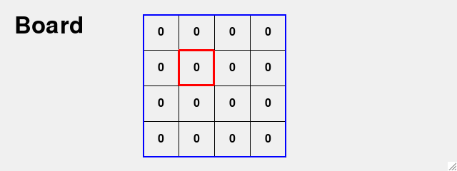

Board Games
===========

In this section we create the framework for board games. 
These games are based on a nxm grid. Each cell can have

* text
* color
* image

Selecting cells with the mouse
------------------------------

.. image:: board2.png

Adding background color
------------------------------

.. image:: board3.png

Create a checkerboard pattern
-----------------------------

.. image:: board4.png