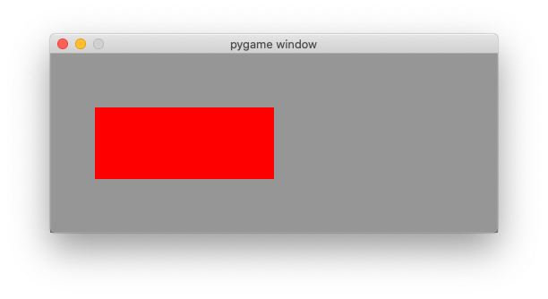
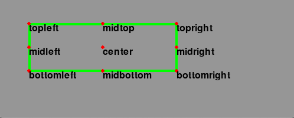
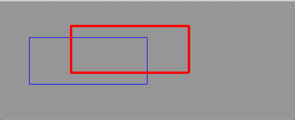
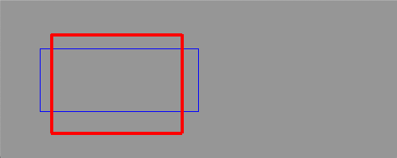
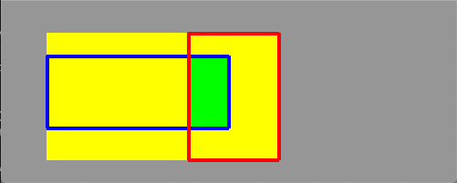
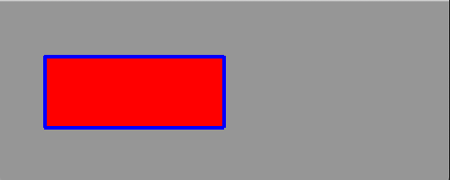
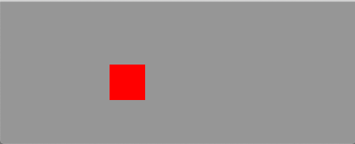
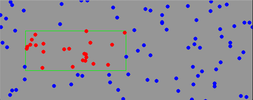
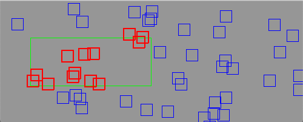
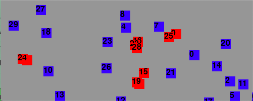

Work with rectangles
====================

The rectangle is a very useful object in graphics programming.
It has its own ``Rect`` class in Pygame and is used
to store and manipulate a rectangular area.
A ``Rect`` object can be created by giving:

* the 4 parameters **left, top, width** and **height**
* the **position** and **size**
* an **object** which has a *rect* attribute ::

    Rect(left, top, width, height)
    Rect(pos, size)
    Rect(obj)

A function which expects a ``Rect`` argument accepts equally one of the three above values.
Methods which change the position or size,
such as ``move()`` and ``inflate()`` leave the original
Rect untouched and return a new Rect.
They also have the *in place* version ``move_ip`` and ``inflate_ip``
which act upon the original Rect.

Virtual attributes
------------------

The Rect object has several virtual attributes which can be used 
to move and align the Rect. 
Assignment to these attributes just moves the rectangle without changing its size::

    x, y
    top, left, bottom, right
    topleft, bottomleft, topright, bottomright
    midtop, midleft, midbottom, midright
    center, centerx, centery

The assignment of these 5 attributes changes the size of the rectangle, by keeping its top left position. ::

    size, width, height, w, h

The following program prints these virtual attributes to the console::

    x=50, y=60, w=200, h=80
    left=50, top=60, right=250, bottom=140
    center=(150, 100)

.. literalinclude:: rect1.py

:download:`rect1.py<rect1.py>`

Points of interest
------------------

The Rect class defines 4 cornerpoints, 4 mid points and 1 centerpoint.

.. literalinclude:: rect2.py

:download:`rect2.py<rect2.py>`

Horizontal and vertical alignment
---------------------------------

In the following example we use 3 keys to align a rectangle horizontally:

* L - left
* C - center
* R - right

and 3 other keys to align the rectangle vertically:

* T - top
* M - middle
* B - bottom

.. literalinclude:: rect3.py

:download:`rect3.py<rect3.py>`

Move a rectangle with keys
--------------------------

The method ``move(v)`` creates a new Rect which has moved by a vector ``v``. 
The method ``move_ip(v)`` moves a Rect **in place**. 
The following program uses the 4 arrow keys to move a rectangle around.
The thin blue rectangle is the orignal one, the thick red rectangle is the moved one.

We use a dictionary to associate a motion vector to each of the 4 arrow keys.
For each direction the movement is by 5 pixels::

    dir = {K_LEFT: (-5, 0), K_RIGHT: (5, 0), K_UP: (0, -5), K_DOWN: (0, 5)}

.. literalinclude:: rect4.py

:download:`rect4.py<rect4.py>`

Inflate a rectangle
-------------------

The method ``inflate(v)`` grows or shrinks a rectangle by a vector ``v`` and creates a new Rect. 
The method ``inflate_ip(v)`` grows or shrinks a Rect **in place**. 
The following program uses the 4 arrow keys to change the size of a rectangle.
The thin blue rectangle is the orignal one, the thick red rectangle is the changed one.

.. literalinclude:: rect5.py

:download:`rect5.py<rect5.py>`

Clip a rectangle
----------------

The method ``r0.clip(r1)`` returns a new rectangle which is the intersection of the two rectangles.
The method ``r0.union(r1)`` returns a new rectangle which is the union of the two rectangles.

The program belows shows two rectangles in red and blue outline. 
The green rectangle is the clipped area (intersection).
The yellow rectangle is the union of the two rectangles.

.. literalinclude:: rect6.py

:download:`rect6.py<rect6.py>`

Move a rectangle with the mouse
-------------------------------

The function ``rect.collidepoint(pos)`` returns True if the point collides with the rectangle.
We use it with the mouse position to check if the mouse click has happened inside the rectangle.
If that is the case, we move the rectangle by the relative motion of the mouse ``event.rel``.

The boolean variable ``moving`` is set when the mouse button goes down inside the rectangle.
It remains True until the button goes up again. The rectangle is only moved when the mouse click
has happened inside the rectangle. While the rectangle is moving, we add a blue outline.

.. literalinclude:: rect7.py

:download:`rect7.py<rect7.py>`

A self-moving a rectangle
-------------------------

The following code moves a rectangle by the amount ``v``::

    rect.move_ip(v)

It then checks the 4 borders and inverts the speed component 
if the rectangle is outside of the application window.

.. literalinclude:: rect8.py

:download:`rect8.py<rect8.py>`

Colliding points
----------------

The method ``rect.collidepoint(p)`` checks if a rectangle ``rect``
collides with point ``p``.
In the following program we create 100 random points and color them red
if they fall inside the rectangle.

Each time the R key is pressed 100 new random points are created.

.. literalinclude:: rect9.py

:download:`rect9.py<rect9.py>`

Colliding rectangles
--------------------

The method ``rect.colliderect(r)`` checks if a rectangle ``rect``
collides with another rectangle ``r``.
In the following program we create 50 random rectangles and color them red
if they collide with the green rectangle.

Each time the R key is pressed 50 new random rectangles are created.

.. literalinclude:: rect10.py

:download:`rect10.py<rect10.py>`

Overlapping rectangles
----------------------

The method ``rect.colliderect(r)`` checks if a rectangle ``rect``
collides with another rectangle ``r``.
If we want to know if there are any two overlapping rectangles,
then we have to compare each rectangle with each other one.
The number of comparisons increases as power of 2.

Each time the R key is pressed 20 new random rectangles are created.

.. literalinclude:: rect11.py

:download:`rect11.py<rect11.py>`

The common code
---------------

The common has been placed to a separate file:

.. literalinclude:: rect.py

:download:`rect.py<rect.py>`