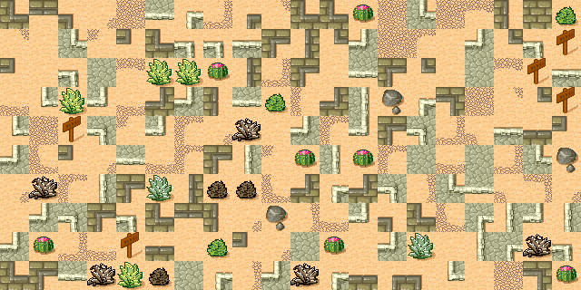
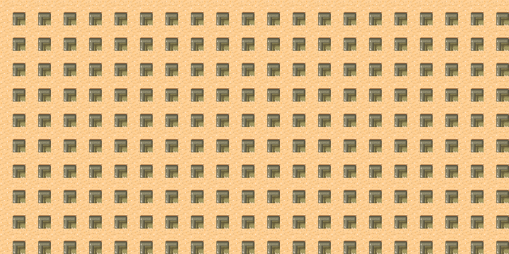

Tiles
=====

Tiles are small squares to compose an image.
Below is an image which has 6 x 8 tiles. Each tile has 32 x 32 pixels.

.. image:: tmw_desert_spacing.png

The tiles with a 1 pixel separation

.. literalinclude:: tiles0.py

:download:`tiles0.py<tiles0.py>`

The code displays the image and writes this to the output console::

    <Surface(265x199x32 SW)>

The margin around the image and the separation line is 1 pixel.

- 8 x 33 + 1 = 265 pixel wide
- 6 x 33 + 1 = 199 pixel high

:download:`tiles1.py<tiles1.py>`

.. literalinclude:: tiles1.py

Create a Tileset
----------------

.. literalinclude:: tiles2.py
   :pyobject: Tileset

Create a Tilemap
----------------

.. literalinclude:: tiles2.py
   :pyobject: Tilemap

The R key fills the map with random tiles.

The Z key fills the map with zero-index tiles.

Navigation
----------

Tiled : a tile-map editor
-------------------------

Tiled is a 2D level editor
https://www.mapeditor.org

Download a tile set
https://opengameart.org/content/zelda-like-tilesets-and-sprites

YouTube tutorials for Tiled
https://gamefromscratch.com/tiled-map-editor-tutorial-series/

Importing a TMX map into Python
https://pytmx.readthedocs.io/en/latest/index.html

Pygame Tiled demo
https://github.com/pricheal/pygame-tiled-demo