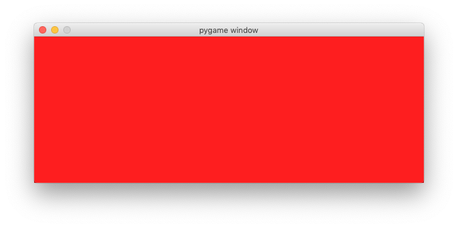
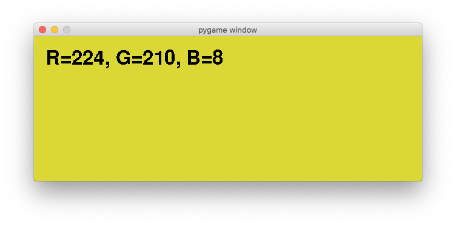

Introduction to Pygame
======================

Pygame is a multimedia library which as basically a wrapper around the SDL (Simple DirectMedia Layer) library.

Initialization
--------------

In order to access the classes and methodes defined in the pygame package, the module must first be imported::

    import pygame

The import statement writes the version and the following texte to the console::

    pygame 1.9.5
    Hello from the pygame community. https://www.pygame.org/contribute.html

The pygame import statement is always placed at the beginning of the program.
The effect is to import the classes and methods, which can be accessed via ``pygame.method()``. 

Then we initialize all submodules with the following line::

    pygame.init()

Finally we set the screen size and assign the ``Surface`` object to the variable ``screen``::

    screen = pygame.display.set_mode((640, 240))

Running this program opens a window and closes it immediately. 

The event loop
--------------

One of the essential parts of any game or user application is the event loop. 
Events are the things that can happen, such as a mouse click, a mouse movement, or a keyboard press. 
The following is an infinite loop which prints all events to the console::

    while True:
        for event in pygame.event.get():
            print(event)

On the console you find something like this::

    <Event(4-MouseMotion {'pos': (173, 192), 'rel': (173, 192), 'buttons': (0, 0, 0), 'window': None})>
    <Event(2-KeyDown {'unicode': 'a', 'key': 97, 'mod': 0, 'scancode': 0, 'window': None})>
    <Event(3-KeyUp {'key': 97, 'mod': 0, 'scancode': 0, 'window': None})>
    <Event(12-Quit {})>

In order to quite the program, make the console the active window and type ``ctrl-C``. 

Quitting the event loop
-----------------------

In order to quit the game with the window close button (QUIT event) we modify the event loop::

    running = True
    while running:
        for event in pygame.event.get():
            if event.type == pygame.QUIT:
                running = False

    pygame.quit()

.. image:: tutorial2.png

Object oriented Programming
---------------------------

From now on we will use object-oriented programming (OOP) style. We define a ``Game`` class which is main game object.
It has a ``run()`` method which launches the event loop.

.. automodule:: tutorial3

.. autoclass:: Game
   :members:

.. image:: tutorial3.png

Changing background color
-------------------------

Colors are defined as tuples of the three components red, green and blue. 
Each component is represented as an integer value from 0 to 255.
Here are some color definitions::

    BLACK = (0, 0, 0)
    RED = (255, 0, 0)
    GREEN = (0, 255, 0)
    BLUE = (0, 0, 255)

In the event loop we decode the key down event::

    if event.type == pygame.KEYDOWN:

and within the all possible key down events we use the R, G, and B key to set the color::

    if event.key == pygame.K_r:
        self.color = RED
    elif event.key == pygame.K_g:
        self.color = GREEN
    elif event.key == pygame.K_b:
        self.color = BLUE

.. automodule:: tutorial4

.. autoclass:: Game
   :members:

Display text
------------

In order to display text we need to create a ``Font`` object which defines a specific font and a specific size::

    self.font = pygame.font.Font(None, 48)

The font object has ``render()`` method which creates a ``Surface`` object which is like an image::

    s = 'Hello world.'
    self.text = self.font.render(s, False, RED)

This ``Surface`` object can be placed on the screen like any image::

    self.screen.blit(self.text, (20, 20))

.. automodule:: tutorial5

.. autoclass:: Game
   :members:

.. image:: tutorial5.png

Composing an RGB color
----------------------

In the following program we use the R, G, and B key to compose the RGB value of the background color.

.. automodule:: tutorial6

.. autoclass:: Game
   :members:

Display the mouse position
--------------------------

.. automodule:: tutorial7

.. autoclass:: Game
   :members:

.. image:: tutorial7.png

Demo
----

To show what Pygame can do, here is a simple program 
that does a bouncing ball animation::

    import sys, pygame
    pygame.init()

    size = width, height = 640, 480
    speed = [2, 2]
    black = 0, 0, 0

    screen = pygame.display.set_mode(size)

    ball = pygame.image.load("ball.gif")
    ballrect = ball.get_rect()

    while True:
        for event in pygame.event.get():
            if event.type == pygame.QUIT: 
                sys.exit()

        ballrect = ballrect.move(speed)
        if ballrect.left < 0 or ballrect.right > width:
            speed[0] = -speed[0]
        if ballrect.top < 0 or ballrect.bottom > height:
            speed[1] = -speed[1]

        screen.fill(black)
        screen.blit(ball, ballrect)
        pygame.display.flip()