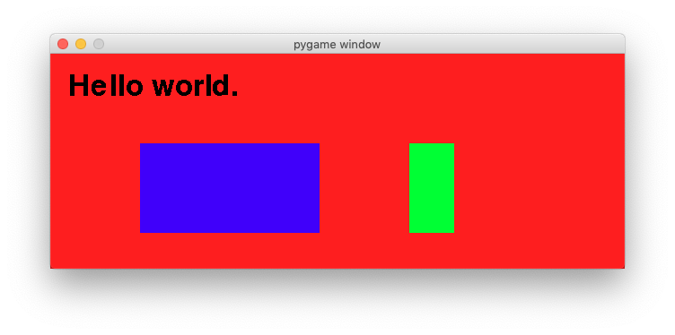
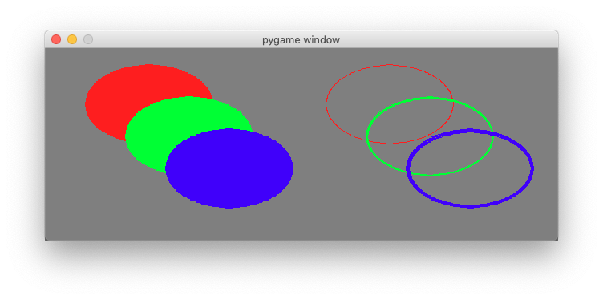
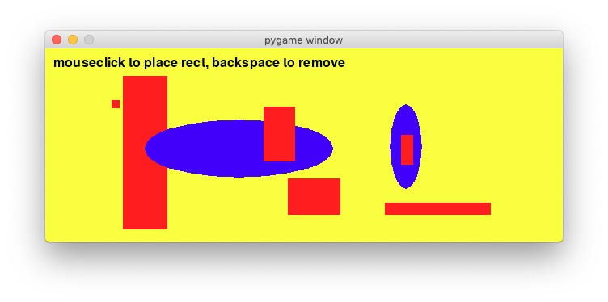
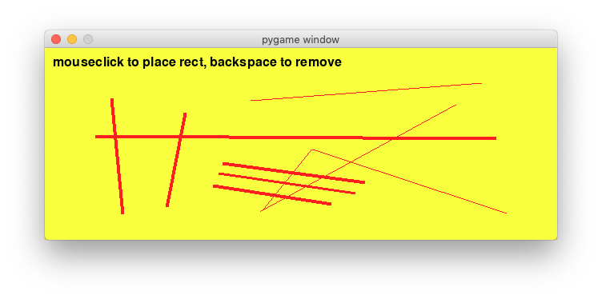
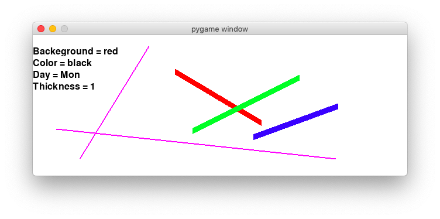
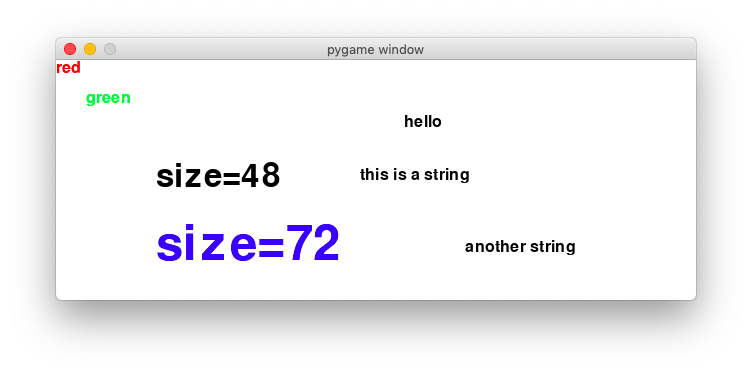
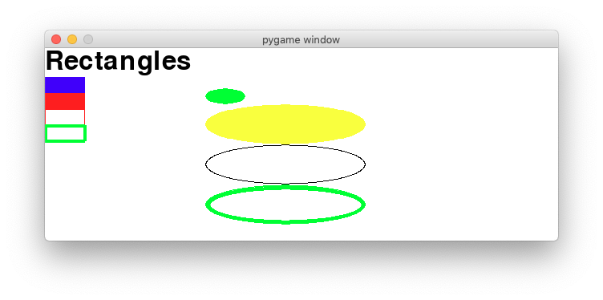
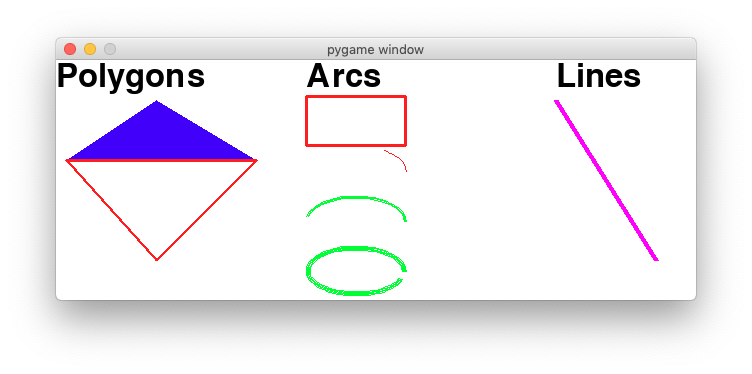
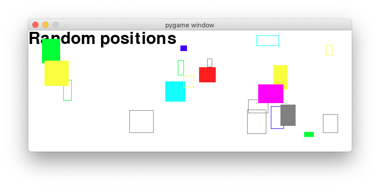

Drawing primitives
==================

The ``draw`` module allows to draw simple shapes to a surface:

* rectangle
* polygon
* circle
* ellipse
* arc
* line
* lines

The functions have the following format::

    rect(Surface, color, Rect, width) -> Rect
    polygon(Surface, color, pointlist, width) -> Rect
    circle(Surface, color, center, radius, width) -> Rect

Most of the functions take a width argument. If the width is 0, the shape is filled.

.. automodule:: draw1

.. autoclass:: App
   :members:



Draw a rectangle
----------------

In the next example we use the arrow keys to move the rectangle and alt+arrow to resize the rectangle.
We define a dictionary which associates the 4 arrow keys with a displacement vector::

    d = {K_UP:(0, -10), K_DOWN:(0, 10), K_LEFT:(-10, 0), K_RIGHT:(10, 0)}

The code for the movement becomes now very simple::

    if event.type == pygame.KEYDOWN:
        if event.key in d:
            vec = d[event.key]
            if event.mod & KMOD_ALT:
                self.rect.inflate_ip(vec)
            else:
                self.rect.move_ip(vec)

We define also a color dictionary which associations a character key with a color::

    color = {K_r:RED, K_b:BLUE, K_g:GREEN, K_m:MAGENTA, 
                K_c:CYAN, K_y:YELLOW, K_k:BLACK, K_w:WHITE}

Again, when using dictionaries, the code becomes very short and simple::

    if event.key in color:
        if event.mod & KMOD_ALT:
            self.bg = color[event.key]
        else:
            self.col = color[event.key]

.. automodule:: draw2

.. autoclass:: App
   :members:



Place a rectangle with the mouse
--------------------------------

In the next program we use the mouse button to draw a rectangle.

 .. automodule:: draw3

.. autoclass:: App
   :members:



Draw lines
----------

 .. automodule:: draw4

.. autoclass:: App
   :members:




The App class
--------------

The basic structure of a game is always the same.
We create a ``App`` class from which we can sub-class our applications.

The constructor method

* initilizes the module
* creates a display window, stored as class variable ``App.screen``
* defines a background color
* defines an empty ``objects`` list::

    class App():
        """Define the main game object and its attributes."""
        def __init__(self):
            pygame.init()
            App.screen = pygame.display.set_mode((640, 240))
            self.bg_color = WHITE
            self.objects = []

The ``run()`` method enters the game loop. Only the QUIT event
is handled. All other events are sent to the ``on_event`` function::

    def run(self):
        """Run the main event loop.
        Handle the QUIT event and call ``on_event``. """
        running = True
        while running:
            for event in pygame.event.get():

                if event.type == QUIT:
                    running = False
                else:
                    self.on_event(event)
            self.draw()

If a game has events and interacts with the user then the ``on_event```
method must be implemented::

    def on_event(self, event):
        """Implement an event handler."""
        pass

The ``draw()`` method 

* draws the background
* draws all the objects in the ``objects`` list
* updates (flips) the display::

    def draw(self):
        """Draw the game objects to the screen."""
        self.screen.fill(self.bg_color)
        for object in self.objects:
            object.draw()
        pygame.display.flip()

.. automodule:: draw5

.. autoclass:: LineDemo
   :members:




Text demo
---------

The basic structure of a game is always the same.
We create a ``App`` class from which we can sub-class.

 .. automodule:: draw6

 .. autoclass:: Text
    :members:

.. autoclass:: ListLabel

.. autoclass:: TextDemo
   :members:



Drawing shapes
--------------

The **pygame.draw** module has methods for drawing shapes to the screen:

* pygame.draw.rect
* pygame.draw.polygon
* pygame.draw.circle

The methods only draw the shape once. Using an object-oriented approach we are going 
to define classes for each shape. There is a common class which we call ``Shape`` 

The class defintion begins with a couple of **class attributes**::

    class Shape:
        """Base class for geometric shapes having size, color and thickness."""
        size = [50, 20]  # default size
        color = BLUE     # default color
        d = 0            # default thickness
        v = [0, 0]       # default speed

The constructor methods finds the attribute values for the shape either from the 
class attribute, or from the argument passed::

        if pos != None:
            App.pos = list(pos)
        self.pos = App.pos[:]

        if size != None:
            Shape.size = list(size)
        self.size = Shape.size[:]
        App.pos[1] += Shape.size[1] 
        
        if color != None:
            Shape.color = color
        self.color = Shape.color

        if d != None:
            Shape.d = d
        self.d = Shape.d

        if v != None:
            Shape.v = list(v)
        self.v = Shape.v

At the end we define the enclosing rectangle which is used by some of the drawing methods.
Finally the object is appended to the objects list::

        self.rect = Rect(self.pos, self.size)
        App.objects.append(self)

The ``draw()`` method needs to be instantiated separately for each object type::

    def draw():
        pass

Rectangles ane Ellipses
-----------------------

This are two derived classes:

.. currentmodule:: pygamelib

.. autoclass:: Rectangle
    :members:

.. autoclass:: Ellipse
    :members:
 
.. autoclass:: Rectangle
    :members:
 



Polygons, Arcs and Lines
------------------------

This are some more derived classes:

.. autoclass:: Polygon
    :members:

.. autoclass:: Arc
    :members:
 
.. autoclass:: Line
    :members:
 



Randomly moving shapes
----------------------

In order to move the shapes, we add an ``update()`` method to ``Shape``::

    def update(self):
        self.pos[0] += self.v[0]
        self.pos[1] += self.v[1]
        if not 0 < self.pos[0] < App.screen.get_width()-self.size[0]:
            self.v[0] *= -1
        if not 0 < self.pos[1] < App.screen.get_height()-self.size[1]:
            self.v[1] *= -1
        self.rect.topleft = self.pos

