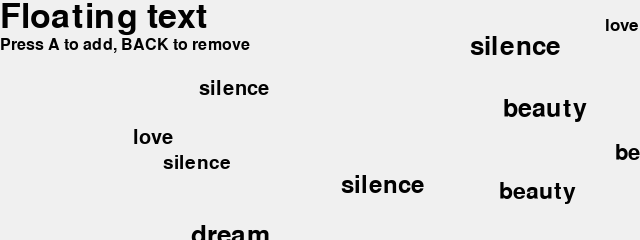
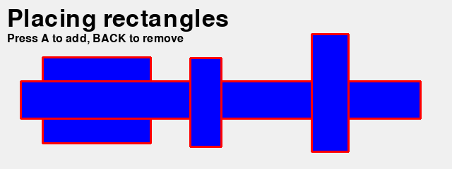

Work with text
==============

.. automodule:: text1

GUI
---

Selecting objects
^^^^^^^^^^^^^^^^^

.. automodule:: gui1

.. autoclass:: GuiDemo
   :members:

Buttons
^^^^^^^

.. automodule:: gui2

.. autoclass:: ButtonDemo
   :members:

.. image:: gui2.png

Board game
----------

 .. automodule:: board1

 .. autoclass:: BoardDemo
    :members:

.. image:: board1.png

To do
=====

* Board games table: number, visibilty, text, color, image
* Selection : arrows and mouse clic
* Multiple selection : cmd+click, drag, (border margins)
* Games: Pong, Snake, Bricks, Space invader, 
* Memory, 2048, Wordament
* Astroid, bullets, gravity
* Platformer games
* Dame, Go, Chess
* Button, ListMenu, TextMenu, CheckBox, Slider
* Select, move and resize an objet
* Edit a polygon
* Collision between objects
* Schedule : one-time and regular
* Music, sounds, images
* Object : x, y, z, scale, rotation, visible, anchor