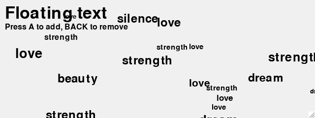
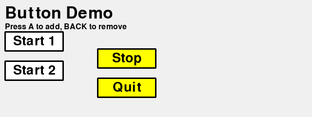

Work with text
==============

.. automodule:: TextDemo
   :members:

.. image:: TextDemo.png

.. automodule:: TextDemo2
   :members:
   

GUI
---

Shortcut keys
^^^^^^^^^^^^^

The simplest way to decode shortcut keys is to use a dictionary. 
This is fast, short and easy to extend. We define the following 
dictionary which uses as the key a simple **keyboard key code** or 
the combination of key and modifier, given as a tuple (k, m). 
The dictionary value is a string which is executable:: 

    d = {
        K_a:'print("A")',
        (K_a, KMOD_LSHIFT):'print("shift+A")',
        (K_a, KMOD_LCTRL):'print("ctrl+A")',
        (K_a, KMOD_LALT):'print("alt+A")',
        (K_a, KMOD_LMETA):'print("cmd+A")', 
        K_UP:'print("UP")',
        K_LEFT:'print("LEFT")',
    }

Inside the :class:`ShortcutDemo` class we implement the :meth:`on_event`.
If the event is a keydown event, we define local variables *k* and *m* 
for the key and modifier.
If *k* is in the dictionary we execute the associated command string. Otherwise we 
execute look if the tuple *(k, m)* is in the dictionary::

    def on_event(self, event):
        if event.type == KEYDOWN:
            k = event.key
            m = event.mod
            if k in d and m == 0 :
                exec(d[k])
            elif (k, m) in d:
                exec(d[k, m])

.. automodule:: gui1

.. autoclass:: ShortcutDemo
   :members:

Buttons
^^^^^^^

.. automodule:: gui2

.. autoclass:: ButtonDemo
   :members:

Selecting objects
^^^^^^^^^^^^^^^^^

.. automodule:: gui4

.. autoclass:: GuiDemo
   :members:

.. image:: gui4.png

Board game
----------

.. automodule:: board1

.. autoclass:: BoardDemo
    :members:

.. image:: board1.png

To do
=====

GUI

* cmd-click : select an item
* alt-click : move selection
* Board games table: number, visibilty, text, color, image
* Selection : arrows and mouse clic
* Multiple selection : cmd+click, drag, (border margins)
* Games: Pong, Snake, Bricks, Space invader, 
* Memory, 2048, Wordament
* Astroid, bullets, gravity
* Platformer games
* Dame, Go, Chess
* Button, ListMenu, TextMenu, CheckBox, Slider
* Select, move and resize an objet
* Edit a polygon
* Collision between objects
* Schedule : one-time and regular
* Music, sounds, images
* Object : x, y, z, scale, rotation, visible, anchor