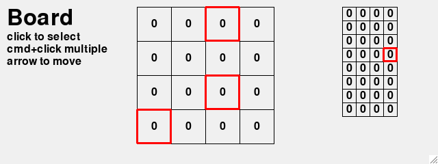

Board Games
===========

In this section we create the framework for board games. 
These games are based on a nxm grid. Each cell can have

* text
* color
* image

.. automodule:: board1

.. autoclass:: BoardDemo
    :members:

.. image:: board1.png

Selecting cells with the mouse
------------------------------

.. automodule:: board2

.. autoclass:: BoardDemo2
    :members:

Adding background color
------------------------------

.. automodule:: board3

.. autoclass:: BoardDemo
    :members:

.. image:: BoardDemo.png